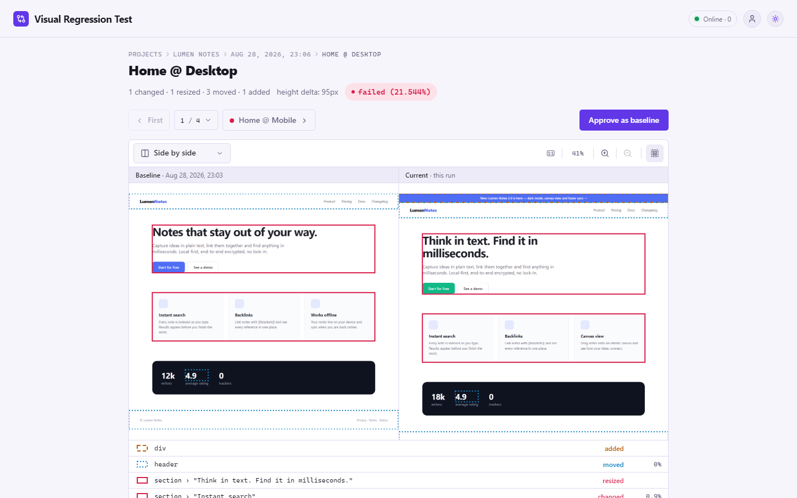
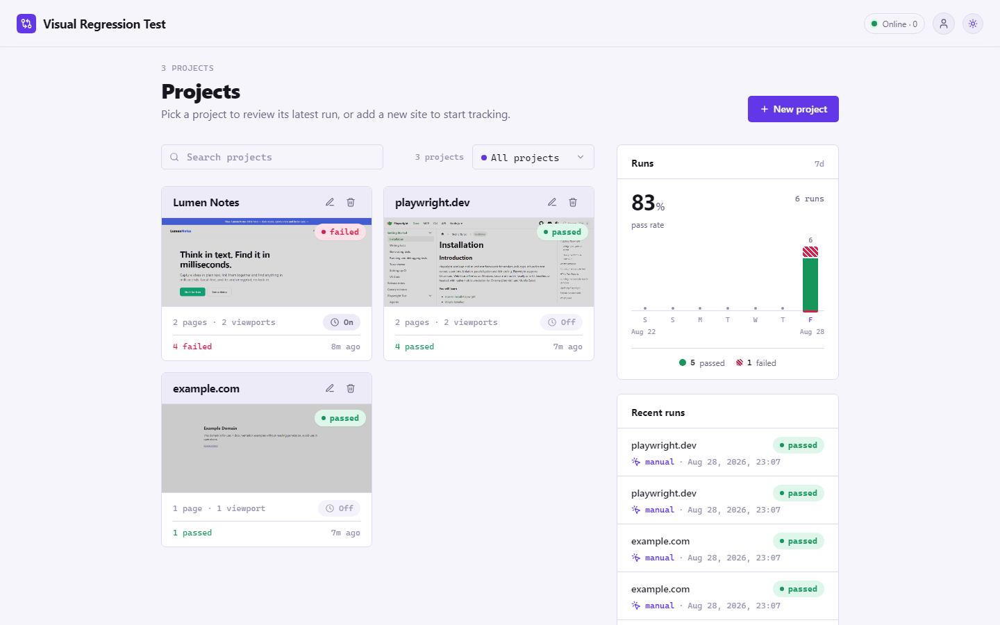
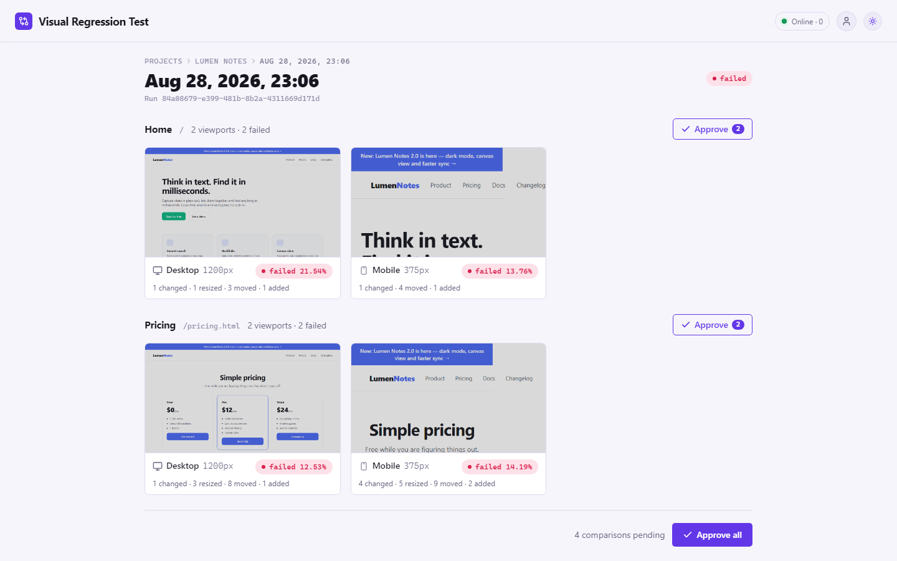
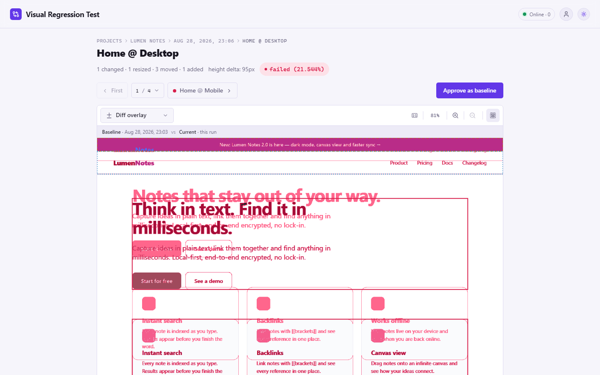
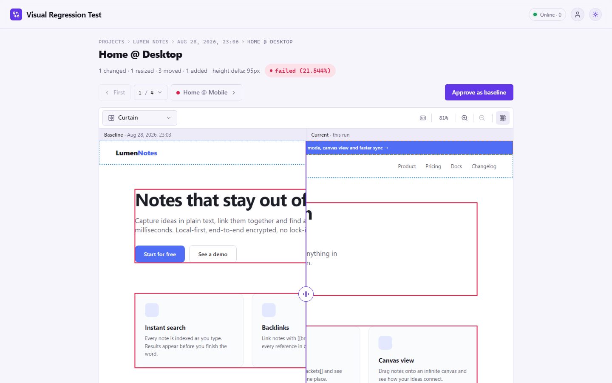
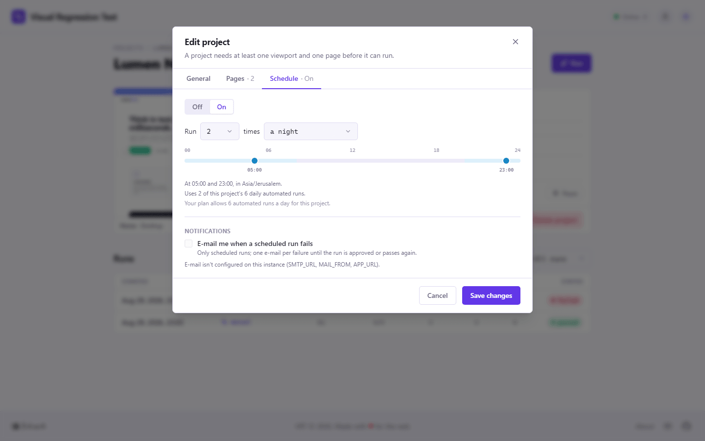

<div align="center">


# Visual Regression Test

**Self-hosted visual regression testing.** Screenshot your pages across
viewports on a schedule, compare them with approved baselines and see
exactly which pixels — and which blocks — changed.

[](https://github.com/yanfishel/visual-regression-test/actions/workflows/ci.yml)
[](LICENSE)
[](https://nextjs.org)
[](https://www.typescriptlang.org)
[](https://playwright.dev)
[](https://www.postgresql.org)
[](https://redis.io)
[](https://docs.docker.com/compose/)

<picture>
  <source media="(prefers-color-scheme: dark)" srcset="docs/screenshots/diff-side-by-side-dark.png">
  
</picture>

</div>

Point it at a site, list the pages, pick the viewports. Every run captures
full-page screenshots with a stabilized headless Chromium, compares them
with the last approved baseline and shows what changed — side by side, as a
curtain, an onion skin or a red diff overlay. Approve a diff and it becomes
the new baseline. 🎉

## ✨ Features

- 🧊 **Deterministic captures** — frozen clock and `Math.random`, disabled
  animations, blocked third-party scripts, webfont and lazy-image waits, a
  scroll pass that settles scroll-triggered reveals, per-page mask and wait
  selectors. Flaky diffs are the enemy of this class of tool, so
  stabilization is a first-class concern, not a patch.
- 🔍 **Perceptual comparison** with [ODiff](https://github.com/dmtrKovalenko/odiff)
  (antialiasing-aware), a per-project mismatch threshold and top-aligned
  comparison when the page height changes.
- 🧩 **Region report** — beside the verdict, the DOM is segmented into
  blocks and each one is compared on its own, so the viewer tells you
  *which* sections moved, resized, changed, appeared or disappeared.
- 🖼️ **Diff viewer** with four modes (side by side, curtain, onion skin,
  diff overlay), synchronized zoom and pan, keyboard navigation and
  one-click approval — single, per page or for the whole run.
- ⏰ **Scheduling** — N runs a day inside a night / day / any-time window,
  in the project's time zone; skipped occurrences are recorded, never
  silently dropped.
- ⚡ **Live updates** over server-sent events: queue position, progress and
  worker liveness without polling.
- 📬 **E-mail notifications** on the first failure of a scheduled run
  (optional, plain SMTP).
- 👤 **Single-user by default**, multi-user with roles and quotas through
  [Clerk](https://clerk.com) when you want it.
- 💾 **Content-addressed screenshot storage** on the local filesystem:
  identical pages cost nothing, old shots are swept after 30 days, diffs are
  never stored.

## 📸 Screenshots

Every screenshot follows your GitHub theme.

<table>
  <tr>
    <td width="50%" align="center">
      <picture>
        <source media="(prefers-color-scheme: dark)" srcset="docs/screenshots/projects-dark.png">
        
      </picture>
      <sub><b>Projects</b> — latest run per project, pass rate for the week, recent activity</sub>
    </td>
    <td width="50%" align="center">
      <picture>
        <source media="(prefers-color-scheme: dark)" srcset="docs/screenshots/run-dark.png">
        
      </picture>
      <sub><b>Run results</b> — one card per page × viewport, approve per page or all at once</sub>
    </td>
  </tr>
  <tr>
    <td width="50%" align="center">
      <picture>
        <source media="(prefers-color-scheme: dark)" srcset="docs/screenshots/diff-overlay-dark.png">
        
      </picture>
      <sub><b>Diff overlay</b> — changed pixels in red, regions outlined</sub>
    </td>
    <td width="50%" align="center">
      <picture>
        <source media="(prefers-color-scheme: dark)" srcset="docs/screenshots/diff-curtain-dark.png">
        
      </picture>
      <sub><b>Curtain</b> — drag the divider between baseline and current</sub>
    </td>
  </tr>
  <tr>
    <td colspan="2" align="center">
      <picture>
        <source media="(prefers-color-scheme: dark)" srcset="docs/screenshots/dialog-schedule-dark.png">
        
      </picture>
      <sub><b>Schedule</b> — a count and a window, the run times are derived</sub>
    </td>
  </tr>
</table>

## 🚀 Quick start

Requirements: Docker with Compose v2.

```sh
git clone https://github.com/yanfishel/visual-regression-test.git
cd visual-regression-test
cp .env.example .env
docker compose up -d
```

Open <http://localhost:3000>, create a project, add a page or two and press
**Run**. The first run per page/viewport becomes the baseline automatically;
every later run is compared against it.

Screenshots are stored under `./.data/shots` (bind-mounted into `web` and
`worker`), the database in the `pgdata` volume.

## 🏗️ Architecture

Four long-lived processes plus a one-shot migration, orchestrated with
Docker Compose:

| Service    | Role                                                                     |
|------------|--------------------------------------------------------------------------|
| `web`      | Next.js 15 — UI, API routes, enqueues runs                               |
| `worker`   | Playwright runner, comparison, scheduler ticker, retention sweep         |
| `postgres` | Projects, runs, comparisons, baselines                                   |
| `redis`    | BullMQ queue + live-update events                                        |
| `migrate`  | Applies the Drizzle migrations, then exits; `web`/`worker` wait for it   |

**Stack:** Next.js 15 (App Router, Server Actions) · React 19 · TypeScript
(strict) · Drizzle ORM + PostgreSQL · BullMQ + Redis · Playwright
(Chromium) · odiff-bin · sharp · Tailwind CSS + Radix primitives · vitest.

## 🧑‍💻 Local development

Requirements: Node 22+, Docker (for Postgres and Redis).

```sh
npm install
cp .env.example .env
cp .env.example apps/web/.env      # Next reads env from apps/web
npm run dev                        # postgres+redis in Docker, migrate, web + worker with watchers
npm run db:seed                    # optional demo projects
```

`npm run dev` points both children at `localhost` and `./.data/shots`; you
only need to edit the env files for Clerk or SMTP.

| Command                                                              | Does                                           |
|----------------------------------------------------------------------|------------------------------------------------|
| `npm test` · `npm run typecheck` · `npm run lint` · `npm run format:check` | vitest · tsc across workspaces · ESLint · Prettier — what CI runs, plus `npm run build:web` |
| `npm run db:generate` / `db:migrate` / `db:seed`                     | Drizzle migration generate / apply, demo data  |
| `npm run e2e`                                                        | Playwright auth suite against a Clerk dev instance (local only, see `docs/notes/auth.md`) |

The worker's region-scan test drives a real Chromium: run
`npx playwright install chromium` once before `npm test`.

## ⚙️ Configuration

Everything is in `.env.example`. The essentials:

| Variable                                     | Meaning                                                                 |
|----------------------------------------------|-------------------------------------------------------------------------|
| `DATABASE_URL`, `REDIS_URL`                  | Connection strings (Compose builds them from `POSTGRES_*`).             |
| `STORAGE_LOCAL_PATH`                         | Directory for screenshots; `local` is the only storage driver.          |
| `AUTH_MODE`                                  | `none` (default, single user, no login) or `clerk` (multi-user).        |
| `CLERK_SECRET_KEY`, `CLERK_PUBLISHABLE_KEY`, `CLERK_ENCRYPTION_KEY` | Required only with `AUTH_MODE=clerk`. The first user to sign in becomes admin. |
| `SMTP_URL`, `MAIL_FROM`                      | Set both to enable e-mail notifications; `APP_URL` is the public base URL used in the links. |

## 🗂️ Repository layout

```
apps/web         Next.js app (routes, components, server actions, API routes)
apps/worker      Playwright runner, queue consumer, scheduler, retention
packages/db      Drizzle schema, migrations, client, seed, shared quota rules
packages/shared  Types, constants, zod schemas, env schemas, schedule maths
packages/storage Storage abstraction (local filesystem driver)
packages/mail    nodemailer wrapper + e-mail renderers
scripts/dev.mjs  One-command dev environment
docs/notes/      Design notes and trap histories per area (UI, auth, worker)
CLAUDE.md        Architecture rules and the map of the codebase
```

`CLAUDE.md` is written for AI coding assistants but is the best single
overview of how the pieces fit and why; `docs/notes/` holds the detail.

## 🤝 Contributing

Issues and pull requests are welcome. Before opening a PR, run
`npm run typecheck && npm run lint && npm run format:check && npm test` —
that is exactly what CI checks.

## 📄 License

[MIT](LICENSE) © Yan Fishel
